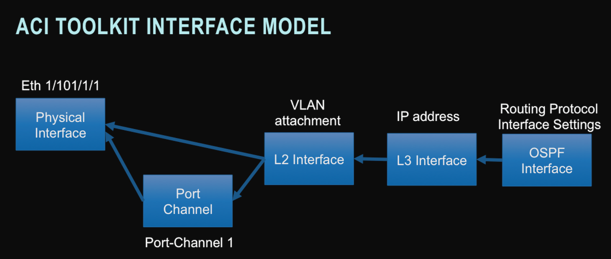
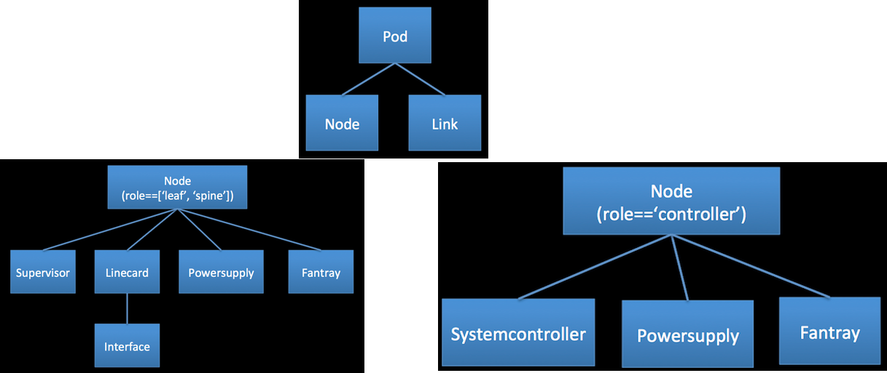

## Object Model
ACI Toolkit has a similar object-model to the APIC, but is much smaller in scope. The Toolkit is broken into 3 sub-areas:

*  Application Topology Model
*  Interface Object Model
*  Physical Topology Object Model

### Application Topology Model
The Application object-model is focused on the Tenant tree. The Tenant is the parent for VRFs, Bridge Domains, Applictation Profiles, Contracts, and Filters. These objects might have their own children, and also will have relationships with other objects inside and outside of the the Tenant tree.

**Tenant** is the root class within the acitoolkit object model hierarchy. All of the application topology configuration occurs within a Tenant.

**AppProfile** is the Application Profile class. It contains the configuration for a given application.

**EPG** is the Endpoint Group class. This is the object for defining configuration that is applied when endpoints connect to the fabric.

**Context** is the class representing an L3 namespace (roughly, a traditional VRF in Cisco terminology).

**BridgeDomain** is the class representing an L2 forwarding domain (roughly, a traditional VLAN). It is associated with a single Context.

**Subnet** is the class representing an L3 subnet. It is associated with a single BridgeDomain.

**OutsideEPG** is the class representing an EPG that connects to the world outside the fabric. This is where routing protocols such as OSPF are enabled.

**Contracts** define the application network services being provided and consumed by EPGs. EPGs may provide and consume many contracts.

**Taboos** define the application network services that can never be provided or consumed by EPGs.

**FilterEntry** contained within either a Contract or a Taboo. Defines the traffic profile that the Contract or Taboo applies.

### Interface Object Model
Interfaces provide the linkage between the application logical topology and the underlying physical network topology. The Interface set of classes are connected through a series of attachment relationships.

The Interface class represents the Physical Interfaces. These are the objects that link the logical topology with the physical world. These objects represent the access ports on the leaf switches. These are the interfaces that the endpoints will physically attach.

**PortChannel** class represents the logical aggregated ethernet port formed by Link Aggregation. This is done by creating a PortChannel instance and attaching one or more Interface instances to it. When interfaces belonging to 2 separate switches are assigned to the same PortChannel, this is referred to as a VPC or Virtual Port Channel. In the acitoolkit, VPCs are also represented by the PortChannel class.

**L2Interface** class represents the logical L2 network attachment on an Ethernet interface. In this case, the Ethernet interface could be an Interface class instance or PortChannel class instance as both are considered representations of link layer Ethernet interfaces.

Multiple logical L2 network attachments can occur on the same Ethernet interface. When this occurs, the L2Interface instances must use different encapsulation identifiers and/or different encapsulation types. The valid encapsulation types are:

*  VLAN
*  VXLAN
*  NVGRE

**L3Interface** class represents the logical L3 network attachment on an L2Interface. The L3Interface instance is where the IP address resides.

**OSPFInterface** class represents the logical router interface that routes from the L3Interface instance. It contains the OSPF-specific interface configuration.

### Physical Topology Object Model

The acitoolkit defines the network topology using a set of objects that represent each of the components of the topology.

These objects are connected in a hierarchy according to the diagrams.

The `acitoolkit.aciphysobject.Node` object is used to represent both switches and controllers. Which kind of `acitoolkit.aciphysobject.Node` can be determined by looking at the role, `Node.role`, attribute. Switches are Nodes with the role of ‘leaf’ or ‘spine’ and controllers are Nodes with the role of ‘controller’. Switches are composed slightly different from controllers as shown in the diagram.

**Pod** is the class for a physical Pod. `acitoolkit.aciphysobject.Pod` conatins of all the switches, links, and controllers that connected in the simple leaf-spine fat tree topology of the ACI fabric. It does not include the end-points or other devices that are attached to the ACI fabric.

**Node** is the class used to represent switches and controllers. What role the `acitoolkit.aciphysobject.Node` plays in the fabric can be determined by looking at the role attribute.

**Link** is the class representing links in the fabric. `acitoolkit.aciphysobject.Link` includes links between leaf and spine switches as well as links from leaf switches to controllers. Each link has two ends, the first and second end, in no particular order. This class has methods for retrieving the Switch, Linecard and Interface for each of the ends of the link.

**Supervisorcard** is the class representing the supervisor card in a switch. `acitoolkit.aciphysobject.Supervisorcard` would only be a child of a Node that has the role of ‘leaf’ or ‘spine’. Each switch will have a supervisor including fixed configuration switches that may not have a obviously physically separate module that is a supervisor. The supervisor is where the primary software of the switch runs.

**Linecard** is the class representing a linecard in a switch. The `acitoolkit.aciphysobject.Linecard` is where all of the physical interfaces or ports are attached. In modular switches, the linecard is physically obvious, but even fixed configuration switches have a linecard where all the interfaces, ports, reside. A specific linecard in a switch is identified by its slot_id attribute. The "slot_id" of a linecard in a fixed configuration switch is always "1".

**Powersupply** `acitoolkit.aciphysobject.Powersupply` is the class representing a power supply in a node.

**Fantray** `acitoolkit.aciphysobject.Fantray` is the class representing a fan tray in a node

**Systemcontroller** `acitoolkit.aciphysobject.Systemcontroller` is the class representing a system contoller of an APIC controller. This is the motherboard of the controller and is a good place to understand the version of software that is running in the controller.

**Interface** `acitoolkit.aciphysobject.Interface` described under the Interface Object Model.

