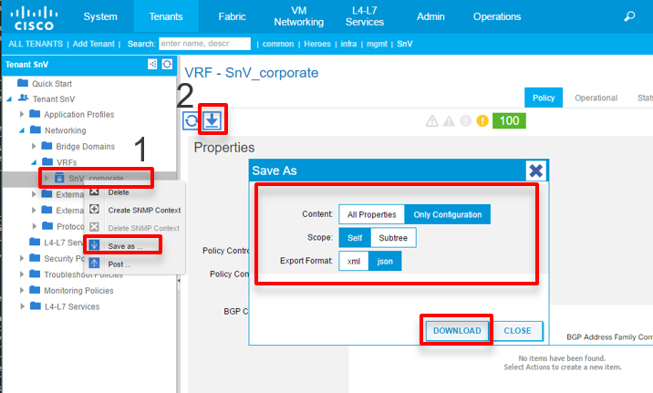
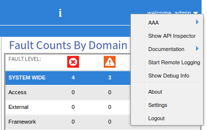

## ACI Programmability

ACI was built with programmability in mind, and designed to be configured and maintained through a central controller via a REST API. This API is how admins interact with the object-model, which allows admins to make changes, gather stats, and troubleshoot the ACI fabric.

The same REST API is used by all interfaces that communicate with the APIC including:

*  GUI
*  CLI
*  ACI Toolkit
*  Cobra SDK


### ACI Toolkit
Many people begin using the REST API with a tool like Postman, which is an easy way to get familiar and make test API calls.  ACI offers another tool, ACI Toolkit, that makes it easy to start interacting with the APIC programmitically. ACI Toolkit is set of Python libraries that are built to interact with a subset of the more commonly used objects in the MIT. It also comes with a collection of ready made python apps built to accomplish specific tasks.

While ACI Toolkit is a great way to program against a fabric, it was built to only perform the most common of operations on a fabric.  There is another Python library called Cobra that is a fully functional, 1:1 mapping of the MIT. 

### Cobra SDK
Cobra is a Python SDK that supports CRUD (Create, Read, Update, Delete) operations of an ACI fabric. Since this is a complete mapping of the object-model, it will be more complex than the ACI Toolkit Library and is usually used by more software developers as compared to network engineers using ACI Toolkit. The Cobra libraries are dowloaded directly from the APIC:

1.  Browse to https://apic_address/cobra/_downloads/
2.  Dowload both .egg files
  *  acicobra-version.egg
  *  acimodel-version.egg

Once the packages have been downloaded, you can use **easy_install** to install them. 

> Note: The acicobra package should be installed before the acimodel.


```bash
$ easy_install -Z directory/path/acicobra-version.egg
$ easy_install -Z dierctory/path/acicobra-version.egg
$ 
```

More information can be found at http://cobra.readthedocs.io/en/latest/install.html. Once both packages have been successfully installed, the Cobra libraries are ready to be imported and used like any other Python library.


### Arya - Simplifying Cobra's Complexity

It was previously stated that the Cobra libraries were more complex than using the Toolkit library; fortunately Cisco provides some tools to help administrators easily overcome this. 

Arya, the APIC Rest pYthon Adapter, will asist with generating a Python Script that uses the Cobra libraries. Arya takes either XML or JSON configuration data as inputs and outputs the Python code that would be used to generate the same configuration.  Yes, Arya does in fact auto-generate code for you!


You should always review the script for accuracy and make any changes that are required. You will likely need to change the APICs URL, Username, and Password that the script uses to establish a connection with the APIC. Also, if you submitted XML or JSON of an existing configuration, then you will need to change the necessary configuration parameters for the new object.

**Configuration Downloads**

It is great that Arya provides an easy way to build Cobra Scripts, but it might seem overwhelming to start writing large XML or JSON configuration files. Luckily ACI provides two easy ways to obtain existing configurations in XML or JSON.

**GUI Downloads**

The first method that is availble for configuration downloads is by exporting an object's configuration in the APIC GUI. There are two ways to download an existing configuration:

1.  Browse to the object in the GUI
2.  Select the download option
  *  Right click on the object in the directory menu (1)
  *  Click the down arrow (2)
3. A menu will pop up with Download Options:
  *  "All Properties" will include the full object-model information for the MO. "Only Configuration" will just download configuration portions of the object, and is sufficient for input into Arya.
  *  The Scope can either be "Self," which is just this particular object, or all child objects of the MO called the "Subtree."
  *  The data can be exported as either XML or JSON, Arya will take either one.



The above example shows a sample of downloaded just the configuration of a VRF MO in JSON. The file would look like:
```json
{
  "fvCtx": {
    "attributes": {
      "descr": "",
      "dn": "uni/tn-SnV/ctx-SnV_corporate",
      "name": "SnV_corporate",
      "pcEnfDir": "ingress",
      "pcEnfPref": "enforced"
    }
  }
}
```

This is a simple example used for brevity, but usually it is better to download the "Subtree" of an object's configuration. Downloading a child's objects will create a full configuration of an object. As an example, downloading just a Bridge Domain object will provide some basic configurations such as the Bridge Domain name. However, if the child objects were also downloaded, then the script would also configure new Subnets in the Bridge Domain.

**API Inspector**

The API Inspector is another way to get sample JSON configuration data to use as an input into Arya. Instead of downloading existing configuration data, the API Inspector sniffs for API requests being made to the APIC and displays that in a new browser window. The Inspector is started by clicking on the "welcome" dropdown and selecting "Show API Inspector." This launches the new browser window that displays the API requests being made.



Navigating around in the APIC will generate GET requests that will be captured by the API Inspector. Making new configurations in the GUI will generate POST requests that will be captured by the API Inspector. The payload will be similar to browsing to an object and downloading the object’s configuration as just discussed.


Unlike the XML/JSON download feature, the API Inspector also provides the URL in addition to the configuration data. This is the exact URL that you would use when using an API tool like Postman, which can be very helpful when trying to query a very specific object that requires a more complex filter string.

The API inspector provides a search feature, which can be useful when many logs are being generated. It can also be helpful to collect a few requests and then push the "clear" button to get a clean screen. A couple of more options are to display either the newest or the oldest on top, and whether or not to auto-scroll to the latest request as new logs are written.


