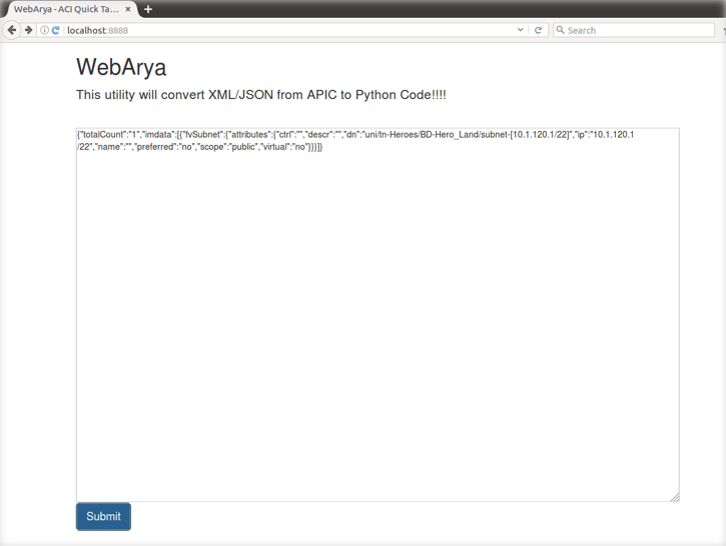
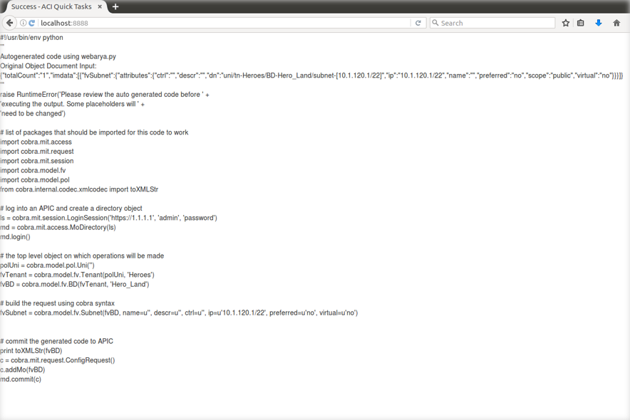

## Using WebArya
WebArya is used by starting the service and opening a web browser. WebArya is a Flask based application that is started by executing `webarya.py`; the `-p` flag can be used to specify a port other than the default, 8888. Instead of inputing a file, the XML or JSON configuration is pasted into the the browser prompt.

```
$ cd webarya
$ ls
hello.py  __init__.py  README.md  static  templates  webarya.py
$ python webarya.py
 * Running on http://0.0.0.0:8888/ (Press CTRL+C to quit)
 * Restarting with stat
 * Debugger is active!
 * Debugger pin code: 102-464-421
127.0.0.1 - - [07/Feb/2017 00:15:30] "GET / HTTP/1.1" 200 -
127.0.0.1 - - [07/Feb/2017 00:15:30] "GET /static/bootstrap.min.js HTTP/1.1" 304 -
127.0.0.1 - - [07/Feb/2017 00:15:30] "GET /favicon.ico HTTP/1.1" 404 -

```

Leave the terminal and open a browser to http://localhost:8888/


The large box in the middle of the page is where the XML or JSON is entered, and clicking submit will return the same output as using Arya in a terminal prompt.

### WebArya Example

We will use WebArya to walkthrough an example of collecting an existing configuration and turning it into a Python script.

**Download JSON in the GUI**

The first step in building a script with WebArya (or Arya) is to obtain a sample configuration file to use as the input source. One way of getting this file is to download an existing configuration in the APIC GUI; this example will obtain the configuration from a Subnet MO.

1.  Browse to the top-level MO, Tenant "Heroes"
2.  Select the Subnet object
3.  Click the down arrow to bring up the Download options
4.  Choose the Download options
5.  Click "DOWNLOAD" to save the file locally


**Convert JSON to Python**

The next step is to load the file's contents into WebArya and return the Python code. Using WebArya, the file has to be opened and the data copied to the webpage.



Click submit and the page should show you the results. If the JSON or XML is formatted incorrectly, the page will show the error logs.



The code returned is a script that would configure the exact same object, but a little cleanup is required before it will execute.


**Create a Save a new Python file**

The Python script has a few places that will require some attention, which is best done by transferring to a text editor and saving it as a Python file. 

Save the file as `test-arya.py`.

This lab will walk through each section of the file and explain what it is used for, and what changes should be made. Since the object that was used to obtain configuration data was the Subnet MO, this will assume the purpose was to add a new Subnet to the existing Bridge Domain.

**The Shebang**

The first line in the script is the shebang line, which informs the system which Python to use when executing the file. This allows users to type `./program.py` instead of `python program.py`. This line does not need to be changed.  In fact, this is the recommended shebang as it allows you to change a system/environment setting to change the version of Python being used rather than neededing to change the inside of every Python program you have.

```python
#!/usr/bin/env python
```

**Keep Existing Document**

The next section is a multiline comment that provides the JSON data used to generate the script. This is good to keep in the file for documentation purposes.
```python
'''
Autogenerated code using webarya.py
Original Object Document Input:
{"totalCount":"1","imdata":[{"fvSubnet":{"attributes":{"ctrl":"","descr":"","dn":"uni/tn-Heroes/BD-Hero_Land/subnet-[10.1.120.1/22]","ip":"10.1.120.1/22","name":"","preferred":"no","scope":"public","virtual":"no"}}}]}
'''
```


**Raise Error**

This section is a warning message provided by Arya that is meant to prevent the script from execution. This is a reminder that the code will need to have some things changed and that it should be reviewed before exectution.
```python
raise RuntimeError('Please review the auto generated code before ' +
'executing the output. Some placeholders will ' +
'need to be changed')
```

**Import Libraries**

The rest of the file is the actual code that configures the new object. First the necessary libraries need to be imported.
```python
# list of packages that should be imported for this code to work
import cobra.mit.access
import cobra.mit.request
import cobra.mit.session
import cobra.model.fv
import cobra.model.pol
from cobra.internal.codec.xmlcodec import toXMLStr
```

**APIC Login**

The second step is to provide the login information and establish a connection with the APIC. The URL, Username, and Password will need to be updated for the script to work.

```python
# log into an APIC and create a directory object
ls = cobra.mit.session.LoginSession('https://1.1.1.1', 'admin', 'password')
md = cobra.mit.access.MoDirectory(ls)
md.login()
```

**Create Top Level Objects**

This section of code is for creating the necessary parent objects. `polUni` is the Root of the tree, and `fvTenant` uses the Root to identify the Tenant object "Heroes". The Tenant object is then used to reference the Bridge Domain "Hero_Land". The Bridge Domain object will be the parent for the new Subnet.
```python
# the top level object on which operations will be made
polUni = cobra.model.pol.Uni('')
fvTenant = cobra.model.fv.Tenant(polUni, 'Heroes')
fvBD = cobra.model.fv.BD(fvTenant, 'Hero_Land')
```

**Create New Configurations**

Typically this section is the largest portion of the script, and is where most of the changes happen. This example only has one line since the configuration file was from an object that did not have an child MOs. In order to create a new Subnet under Tenant "Heroes" inside of the Bridge Domain "Hero_Land" the `'ip=u'10.1.120.1/22'` needs to be updated to the new IP Gateway/Mask. Change this to `ip=u'10.1.124.1/22'`.
```python
# build the request using cobra syntax
fvSubnet = cobra.model.fv.Subnet(fvBD, name=u'', descr=u'', ctrl=u'', ip=u'10.1.120.1/22', preferred=u'no', virtual=u'no')
```

**Commit the Configuration**

The final piece is to submit the configuration changes to the APIC. This is done by creating a config request, adding the top level object to the request, and commiting the changes. Since the only changes were to the Bridge Domain object, that is what is added to the configuration request. If changes were made to the Tenant Object, then `fvTenant` would have been added to the request instead of `fvBD`.
```python
# commit the generated code to APIC
print toXMLStr(fvBD)
c = cobra.mit.request.ConfigRequest()
c.addMo(fvBD)
md.commit(c)

```

With the necessary changes to the file in place, all that is left is to save the file and execute the script.

```
$ python test-arya.py
SSL warning
<?xml version="1.0" encoding="UTF-8"?>
<fvBD status='created,modified' name='Hero_Land'><fvSubnet name='' descr='' ctrl='' ip='10.1.124.1/22' preferred='no' status='created,modified' virtual='no'></fvSubnet></fvBD>
SSL warning
```